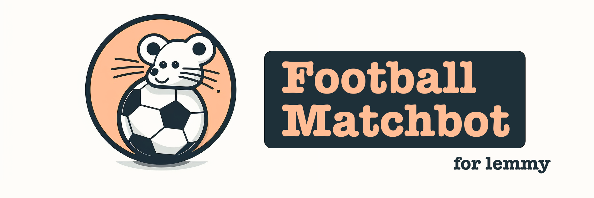

# Lemmy Football Match Thread Bot

👋 Welcome to the Lemmy Football Match Thread Bot repository! This bot is a work in progress that aims to create match threads for football matches on the Lemmy platform. Right now, the basic framework is done.

## Features

✅ The bot will offer the following features:

- Run on a Ubuntu VM to host and execute the bot.
- Use a web interface to easily configure match threads with relevant information.
- Automatically post pre-match, live match, and post-match threads on the Lemmy platform.
- Keep the live match threads updated in real-time with accurate information.

## How It Works

🔧 The bot is powered by a Python backend with a Flask frontend. The data is managed in a PostgreSQL database.

This bot utilizes the API-Football data via Rapid API and posts to Lemmy via its API to create and update posts for match threads.

You will propably need to pay for the API data from API-Football (Free = 100 calls per day). But, unlike *ehm* other API services, you do get a product from it instead of being exploited as the product yourselves.

## Usage

🚀 To use the bot, follow these steps:

1. Clone the repository to your local machine.
2. Install any required dependencies.
3. Set up a PostgreSQL RDMBS. You can also use services like [neon.tech](neon.tech).
4. Rename the `.env.example` file to `.env` and update the necessary credentials inside.
5. Run the bot locally or host it on your VM to start creating and updating match threads on the Lemmy platform. Simply run app.py for this and head over to 127.0.0.1:5500

### Lemmy Community ID

To find out your Lemmy Community ID, quickly head over to your lemmy community you want to post to and inspect the source code. There, search for community ID. Most likely, it's a 5-digit integer. Be careful not to confuse it with one of the Post IDs!

## Roadmap

✅ Here's the roadmap for the future development of the bot:

- [x] Set up the framework to fetch match data and post to Lemmy Communities
- [ ] Implement a user-configurable post body for match threads on the Lemmy platform.
- [ ] Enable the ability to update the post body during live matches to provide real-time information.
- [ ] Develop a scheduler to automate the posting of match threads based on predefined schedules.
- [ ] Create a backend solution specifically for running the bot on an Ubuntu server.
- [~] Design and implement a user-friendly frontend interface to enhance the user experience.

## Contribute

🤝 This project is licensed under the MIT License, and I warmly welcome contributions from the community. Please feel free to open issues, make suggestions, or submit pull requests to help improve the bot.

✨ I appreciate any contributions and participation in making Lemmy a better place for football fans!